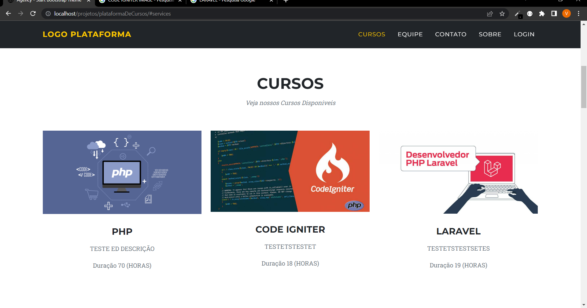
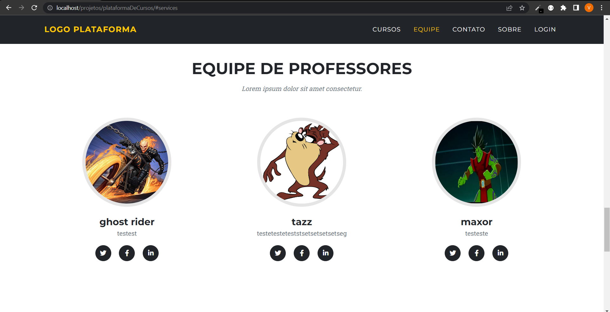
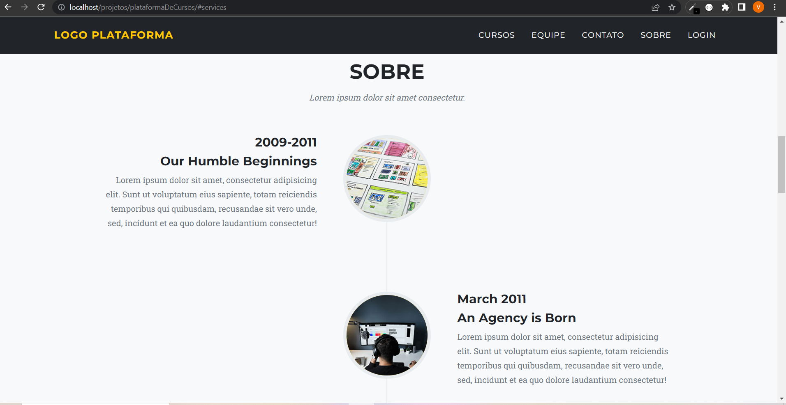
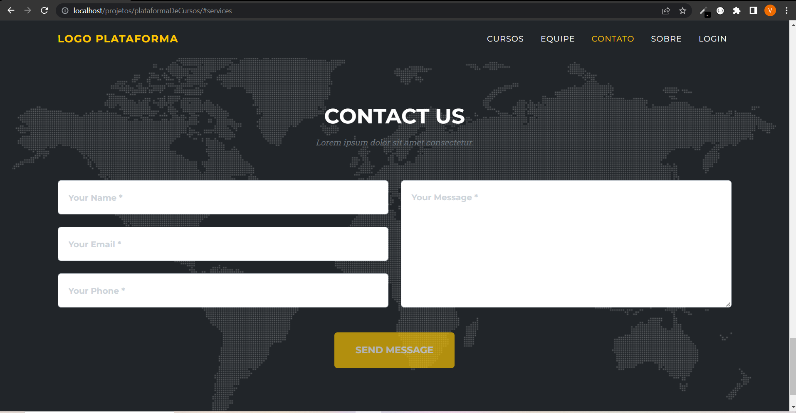
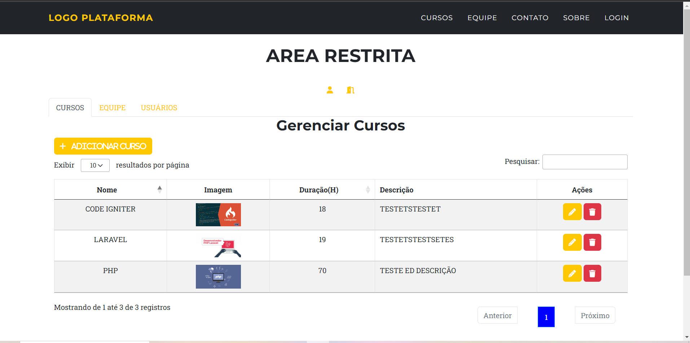
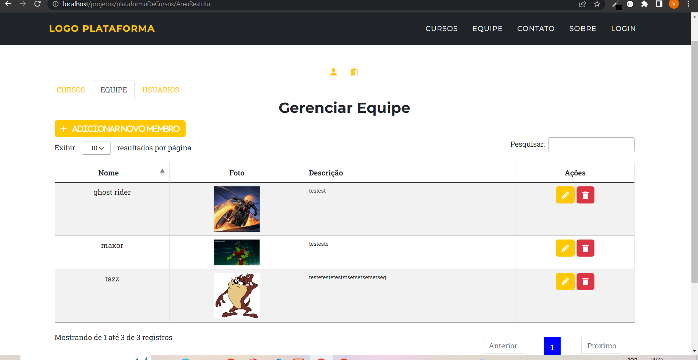
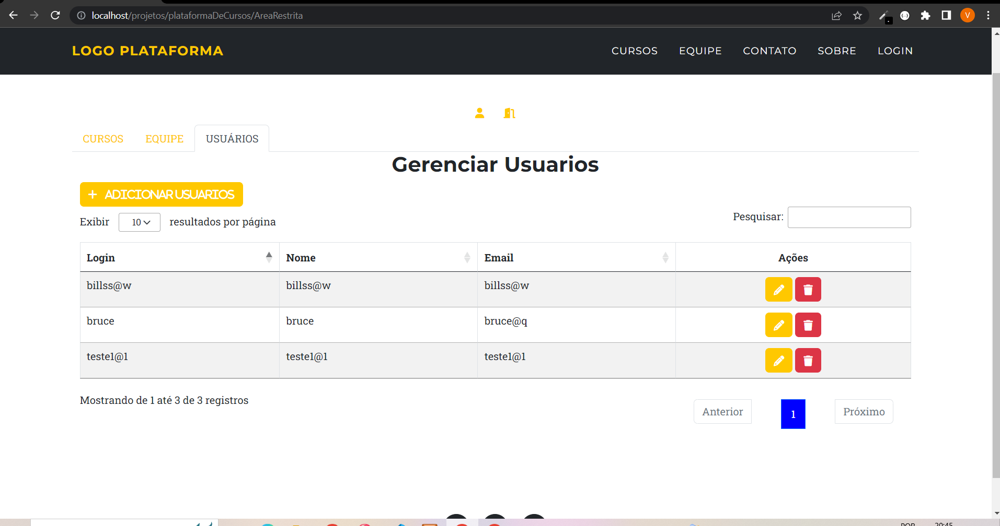
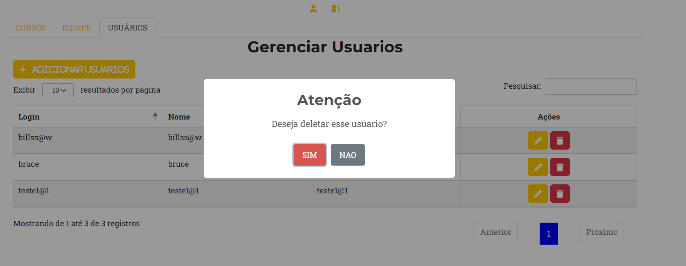

# License Code Iginiter

Please see the [license agreement](https://github.com/bcit-ci/CodeIgniter/blob/develop/user_guide_src/source/license.rst).

# PROJETO
Plataforma de cursos 

# COMO INSTALAR PROJETO 
Instale o Banco de Dados SQL que esta na pasta arquivosExtras la ja vem com um USUARIO=teste e SENHA=123 . A senha esta em hash password

Em Seguida mude a base url no application->config->$config['base_url'] = A URL DO SEU PROJETO

Em seguida mude a url também no public->js->util.js->const BASE_URL = URL DO SEU PROJETO

# IMAGENS DO PROJETO
## HOME
### CURSOS

### EQUIPE

### SOBRE

### CONTATOS

## AREA RESTRITA
### AREA RESTRITA CURSOS

### AREA RESTRITA EQUIPE

### AREA RESTRITA USUARIOS

## BIBLIOTECA SWEET ALERT SENDO USADA COM O AJAX

# TECNOLOGIAS USADAS
- PHP
- CODE IGNITER 3
- HTML
- CSS
- BOOTSTRAP 5
- JAVA SCRIPT
- JQUERY
- SQL
- SWEET ALERTS
- DATA TABLES